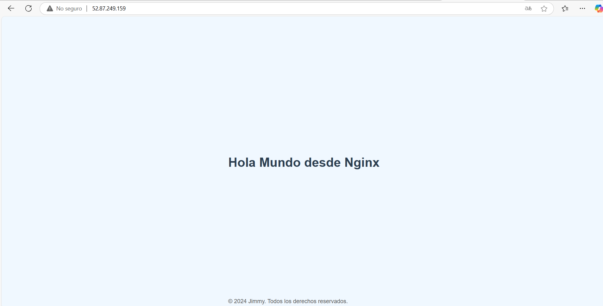

# Hello with EC2
## Scope
<p align="center">
    
</p>
This program to print the messages "Hello" in a instant in EC2

## Instalation
**1.** Clone the Repository
   ```
    https://github.com/Jimmy9812/Practice2_aws.git
   ```

**2.** Once the project has been cloned, you must open it with the VSCode code editor.

**3.** You can run of the proyect en el button

## Deploy in EC2


<p align="right">

</p>
 